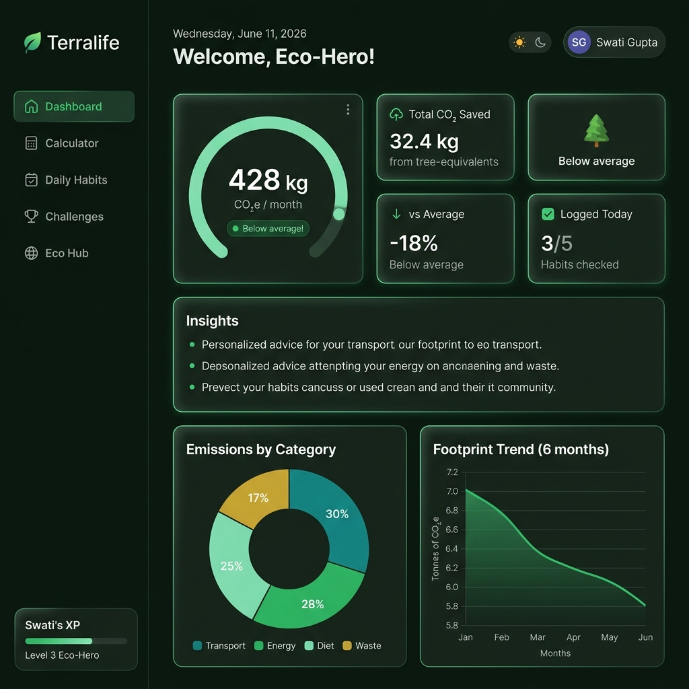
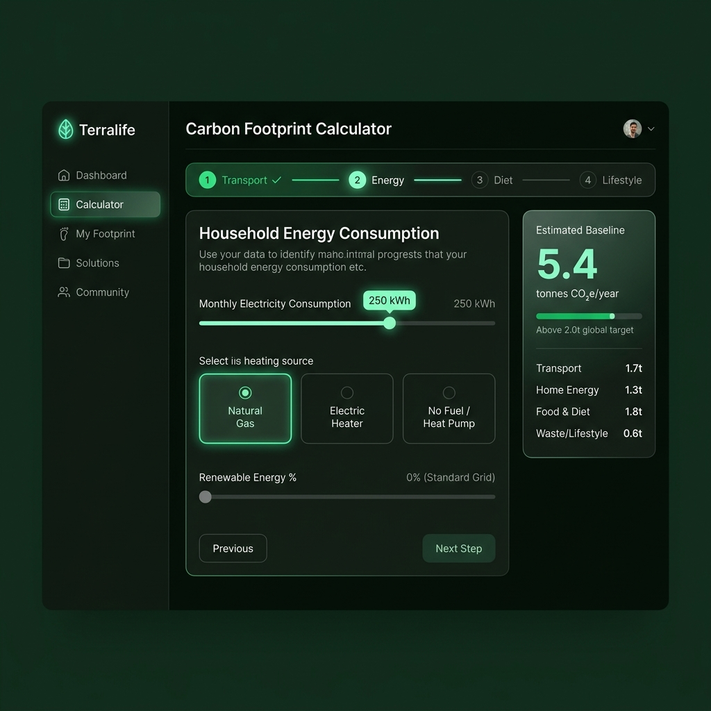
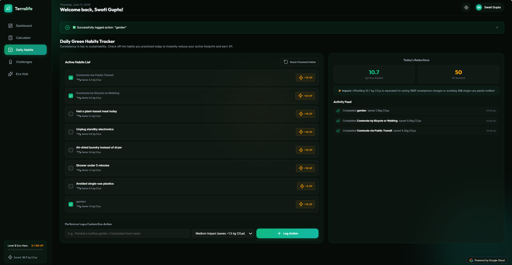
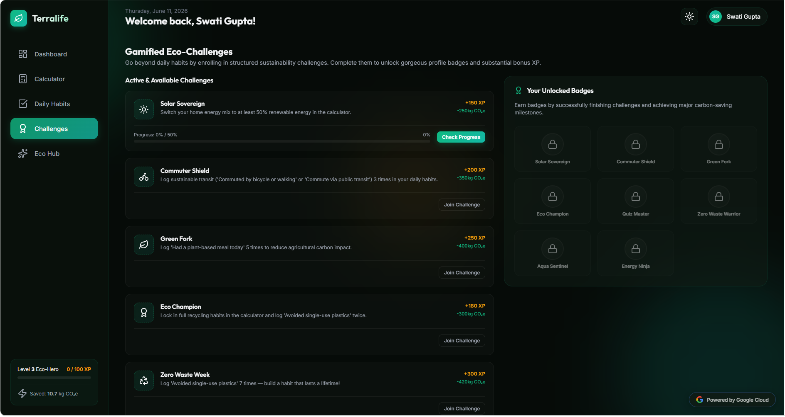
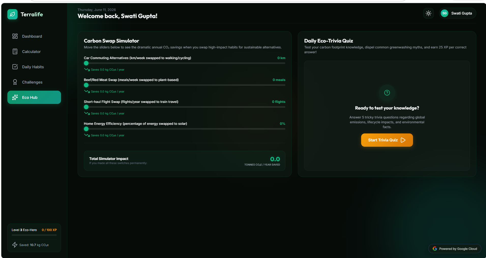
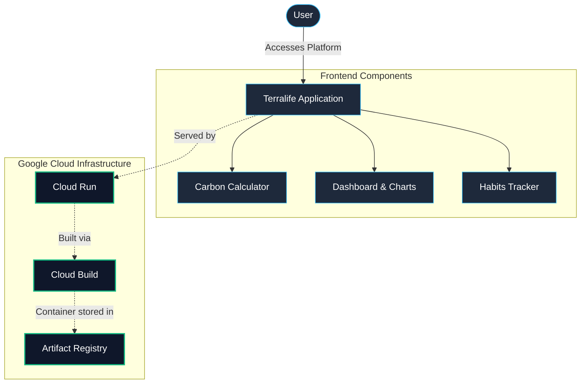

# 🌿 Terralife — Carbon Footprint Awareness Platform

> **PromptWars Challenge 3 Submission** | Built with Google Fonts, Chart.js, and modern Web APIs

[](https://named-deck-495705-v6-419483798137.us-central1.run.app)
[](https://github.com/swatiicfai/PromptWars-Challenge-3)

---

## 📸 App Screenshots

|                                    Dashboard                                    |                              Interactive Calculator                               |
| :-----------------------------------------------------------------------------: | :-------------------------------------------------------------------------------: |
|  |  |

|                                Daily Habits                                 |                               Challenges                                |
| :-------------------------------------------------------------------------: | :---------------------------------------------------------------------: |
|  |  |

|                              Eco Hub                              |
| :---------------------------------------------------------------: |
|  |

---

## 🌍 Problem Statement

**Design a solution that helps individuals understand, track, and reduce their carbon footprint through simple actions and personalized insights.**

Terralife is a premium, interactive Carbon Footprint Awareness Platform that empowers users to:

- **Understand** their environmental impact through an intelligent, multi-step carbon calculator
- **Track** daily green habits and log eco-friendly actions
- **Reduce** their footprint with personalized insights, gamified challenges, and a carbon swap simulator

---

## ✨ Key Features

### 🧮 Multi-Step Carbon Calculator

- 4-step guided wizard: Transportation → Energy → Diet → Lifestyle
- Real-time side panel showing live estimates as you answer
- Accurate CO₂ formulas using IPCC standard emission factors
- Personalized annual baseline in tonnes CO₂e

### 📊 Interactive Dashboard

- Animated SVG gauge showing monthly footprint
- Comparison vs global average (2.0 t/year target)
- Category breakdown donut chart (Chart.js)
- 6-month trend line chart tracking your reduction curve
- AI-generated personalized eco-insights

### ✅ Daily Habits Tracker

- 7 pre-loaded high-impact eco habits with CO₂ savings data
- Custom action logger for unique activities
- Live feed showing today's CO₂ reductions and XP gained
- Confetti celebrations for completing high-impact actions

### 🏆 Gamified Challenges & Badges

- **7 structured challenges** with progress tracking:
  - Solar Sovereign, Commuter Shield, Green Fork, Eco Champion
  - Zero Waste Week, Shower Saver, Energy Ninja _(new!)_
- Unlockable achievement badges (8 total)
- XP leveling system (Eco-Hero ranks)
- Visual badge shelf with locked/unlocked states

### 📤 Export & Share

- **Export PDF** — print-optimised report layout
- **Export JSON** — full data snapshot download
- **Social Share** — Web Share API on mobile, Twitter/X card on desktop

### 🔄 Carbon Swap Simulator

- Interactive sliders showing impact of lifestyle swaps
- Real-time CO₂ savings calculation
- Covers: commuting, diet, flights, and home energy

### 🧠 Daily Eco-Trivia Quiz

- 5 curated questions about climate science
- Earn 25 XP per correct answer
- Detailed explanations for learning
- Quiz Master badge for perfect scores

---

## 🏗️ Project Architecture Flowchart



---

## 🛠️ Technology Stack

| Layer          | Technology                                          |
| -------------- | --------------------------------------------------- |
| **Frontend**   | HTML5, Vanilla CSS (glassmorphism, dark/light mode) |
| **JavaScript** | Vanilla ES6+, LocalStorage persistence              |
| **Typography** | Google Fonts (Inter + Outfit)                       |
| **Icons**      | Lucide Icons                                        |
| **Charts**     | Chart.js                                            |
| **Animations** | Canvas Confetti                                     |
| **Backend**    | Node.js + Express                                   |
| **Container**  | Docker                                              |
| **Hosting**    | **Google Cloud Run**                                |
| **Build**      | **Google Cloud Build**                              |
| **Registry**   | **Google Artifact Registry**                        |

---

## 🚀 Google Technologies Used

- ☁️ **Google Cloud Run** — Serverless container deployment
- 🏗️ **Google Cloud Build** — Automated container builds from source
- 📦 **Google Artifact Registry** — Container image storage
- 🔤 **Google Fonts** — Inter & Outfit typefaces for premium typography
- 🔑 **Google Cloud IAM** — Secure project access control

---

## 🚀 Live Deployment

> **Your live Cloud Run URL:** [https://named-deck-495705-v6-419483798137.us-central1.run.app](https://named-deck-495705-v6-419483798137.us-central1.run.app)

The application is fully containerized using Docker and deployed seamlessly on **Google Cloud Run**, built via **Google Cloud Build**, and stored in **Google Artifact Registry**.

---

## 🏃‍♀️ Running Locally

```bash
# Clone the repository
git clone https://github.com/swatiicfai/PromptWars-Challenge-3.git
cd PromptWars-Challenge-3

# No build needed — open index.html directly in browser
# OR start a quick Python server:
python -m http.server 8080

# Open http://localhost:8080
```

---

## 🐳 Docker

```bash
# Build container
docker build -t terralife .

# Run container
docker run -p 8080:8080 terralife
```

---

## 📐 Carbon Calculation Methodology

Emission factors are sourced from internationally recognized standards:

| Category          | Factor             | Source            |
| ----------------- | ------------------ | ----------------- |
| Petrol Car        | 0.22 kg CO₂e/km    | DEFRA 2023        |
| Electric Vehicle  | 0.05 kg CO₂e/km    | DEFRA 2023        |
| Public Transit    | 0.03 kg CO₂e/km    | IPCC AR6          |
| Electricity Grid  | 0.42 kg CO₂e/kWh   | IEA 2023 Global   |
| Short-haul Flight | 150 kg CO₂e/flight | ICAO              |
| Long-haul Flight  | 950 kg CO₂e/flight | ICAO              |
| Beef-heavy diet   | 2.9 t CO₂e/year    | Oxford Study 2023 |
| Vegan diet        | 0.6 t CO₂e/year    | Oxford Study 2023 |

---

## 🎯 Design Philosophy

Terralife was designed with a **premium dark-mode first** aesthetic featuring:

- Forest green & black slate color palette
- Glassmorphism card components
- Smooth micro-animations and hover effects
- Fully responsive layout (mobile + desktop)
- Light/dark mode toggle with system preference detection
- Accessibility-first semantic HTML structure

---

## 👩‍💻 Built By

**Swati Gupta** | PromptWars Challenge 3  
Built using AI-powered development with Google's Antigravity assistant

---

_"The greatest threat to our planet is the belief that someone else will save it." — Robert Swan_
